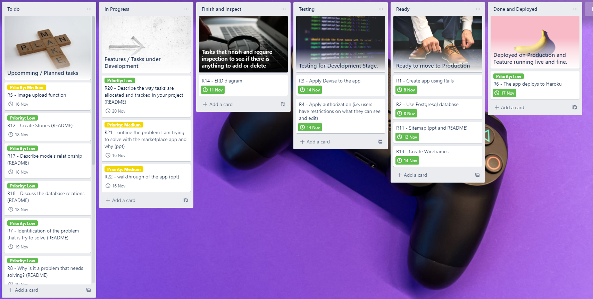

**<u>Problem Identifications and Reason the problem is needed to solve</u>**

People always leave their games without playing for years once they finished playing with them, meanwhile some people seek for a game with lower price. Since the game owners no longer play with the finished games, they occupy space and are worthless to the owners, unless they are treated as collections. In the market, there are always some buyers looking for discounted games that function well regardless of the games condition. Normally, people buy games to enjoy the game experiences instead of collecting them. The lifespan of a game to a owner could be very short. However, it would be another case when it comes to a new owner. The selling of those finished games by the game owners fits in this situation. The games are sold with second-hand price and the owners get back some cash that can save on upgrades. Also, the buyers can enjoy the games with the lower price and the games become valuable again. This greatly enhance the usage or value of the games.

<u>**Deployed Website**</u>

https://gamehub-marketplace.herokuapp.com/listings

**<u>GitHub Repo</u>**

https://github.com/keithc07/Gamehub-marketplace

**<u>Purpose</u>**

This app GameHub is built for the better usage of games which the owners no longer play with. It acts as a platform for users to trade second-hand games. The users of the app can create a sale listing to advertise the second-hand games they plan to sell. Also the users can access the contact information of the sellers in the listings, so they can communicate on the trade and how the trade is implemented, for example the payment methods or find a place to meet each other.

**<u>List of Features</u>**

|     <u>Features</u>     | <u>Descriptions</u>                                          |
| :---------------------: | ------------------------------------------------------------ |
|     Authentication      | Only verified users can access all pages of the app. Unverified users can only access the home page. |
|     Create accounts     | Users are able to create a personal account through registration to access all pages of the app or create a listing. |
|      Authorization      | Users are restricted to view the contact details of the sellers unless they are signed-in. Also users are restricted to edit the listings or profile of other users. Only the user can see the edit and delete button of the lists which are created by him/her or access and edit their own profile. |
|     Create listings     | Users are able to create their own listings with image upload function to advertise their second-hand games. |
| Edit profile / listings | Users can edit all of the details of their profile and listings once they are signed-in. |
|     Search and sort     | Users can perform search or sort to look up the listings they are interested in. |

**<u>Sitemap</u>**


**<u>Screenshots</u>**


**<u>Target Audience</u>**

- Game owners who want to sell their games
- Game buyers who are looking for lower price of a game
- Shops that are selling second-hand games

**<u>Tech Stack</u>**

- HTML
- CSS
- Ruby
- Ruby on Rails 
- Heroku
- Amazon S3 - cloud storage
- PostgreSQL Database

**<u>User Stories</u>**

- As a buyer, I want to know the contact details of the sellers, so that I can contact them to organize the trade.

- As a buyer, I want to know where the sellers are living, so that a face-to-face trading could be organized.

- As a buyer, I want to search the games I am looking for, so that I can reduce the time to find the games.

- As a buyer, I want to sort the gaming console, so that I can look up the games that can play with my consoles.

- As a user, I want to edit my profile, so that I can update the personal details.

- As a user, I want to sign up for a new account, so that my personal details are saved and use in the app.

- As a seller, I want to list the games I plan to sell, so that everyone knows what games I am selling.

- As a seller, I want to edit my listings, so that I can update the listing details.

- As a seller, I want to display the photo of my games, so that it makes the listings more attractive.

- As a seller, I want to delete the listings, so that no one can contact me for the games that are sold-out.

**<u>Wireframes</u>**


**<u>ERD</u>**


**<u>High level Components</u>**

This app has 2 main controllers called UsersController and ListingsController. These controllers make responses according to the route in a URL. The UsersController, which is generated with the gem 'Devise', is responsible to handle requests about user accounts. For example, requests to sign-in, sign-up, edit profile or reset password. It will fetch or save data from the User and related model and display the output in the view of devise. The ListingsController is responsible to handle requests about game listings. For example, a user requests to create, update, show, or delete a game listing. It will fetch or save data from the Listing and related model and display the output in the view of listings. Hence, both controllers handle user requests. It requires the respective models to fetch the data and display the data in the view.

There are 8 models in the app where they are linked together to provide useful information with database. These models interact with the database through Active Records to either save data, validate data, or perform the business logic. User model is one of the models to store data of each user personal information. Also, it is used to authenticate users, for example sign-in, according to their input. If either the email or password is not the same as the data stored in the database for User model, user is not able to login. Address and State models store the address and state information of users respectively. They are required and displayed in the game listings for the purpose of possible face-to-face trading. Meanwhile, the Address model is also a nested model of User model where all attributes of Address model can save or update through the parent User model. As users are required to input both personal and address information in registration, creating nested Address model allows users to save data into the models or database concurrently. Listing model saves the information of game listings created by user. During the creation of game listing, the users can choose the console type of the game which is provided by the Console model. The last 3 models are Active Storage Attachment, Blob, and Variant Record. They work together to store image information, for example, the image size, name, and type. When the users upload the image when creating a game listing, the image information is stored in the models.

For views, there are multiple view files that are associated with the UsersController and ListingsController. These files display the view of each controller action. For example, there is an index file in listings, which is a folder inside views. The file will display the information as in index action of its controller when the users make a request to the index route. The controller will require the corresponding model to fetch the data to the view and allow the view to display the information. There is another type of file that is called partial. It acts like a template where all view files can render it as part of their own. In this case, there are _listing_form.html.erb, _navbar.html.erb, and _heading.html.erb. These are the partial files that are rendered by new and edit files in listings. Normally, all the files inside views folder have the objective to display information. 

**<u>Third Party Services</u>**

The app uses Heroku as one of the third-party services to deploy the website. Heroku provides Platform as a Service (PaaS) with cloud where the app could be easily deployed to the platform and the server is provided by Heroku. Hence, there is nothing to settle in relation to the server, for example, server maintenance or upgrades. Since Heroku and Git can link together, deploy the app to Heroku with Git greatly enhance the efficiency during the deployment process. Moreover, Heroku supports multiple relational database services. The app is currently using PostgreSQL database to handle the business logic. Heroku supports PostgreSQL services and it allow changes over the database of the app. 

Another third-party services used by the app is Amazon S3. Amazon S3 provides cloud storage services and there are different storage classes for different use cases. The main purpose of using Amazon S3 in the app is for image storage. Since the app requires the users to upload a image or picture to create a game listing, the uploaded image occupies storage space. If there are over hundred of game listings in the app, there are also over hundred of images which will occupy a certain amount of storage space. Applying Amazon S3 allows the app to run smoothly and no need to worry about the image storage capacity issues.

**<u>Models Relationships and Database</u>**

User model and Address model has a one-to-one relationship. Since a user can only have one address, the models are associated in a way where a user has one address and an address belongs to one user. A user needs to have at least and up to one address and an address belongs to at least and up to one user. In addition, the Address model is a nested model of the User model. Instead of saving or updating user and address information in the User model only, the nested Address model is created. The purpose of having the nested Address model is for database normalization and allowing users to input both personal and address information together in one form during user registration.

```
class User < ApplicationRecord
	...
	accepts_nested_attributes_for :address
```

State model and Address model has a one-to-many relationship. A state can have many addresses and an address can only have one state. For example, there could be many users living in different suburbs in a state. Hence, a state can have zero to many addresses and an address belongs to at least and up to one state. In the database, it is able to look up any attributes in Address and State model of a user because the models are linked together and in relation to each other. Here are some of the examples:

```
@user.address.suburb #look up the attribute suburb in Address model of a user in database
@user.address.state.state_name #look up the attribute state_name in State model through Address model of a user in database
```

User model also has a one-to-many relationship with Listing model. A user can create as many listings as he/she wants or not create one, thus a user has zero to many listings in association. If there is a listing, there has to be at least or up to one user and the listing belongs to that user.

There is a one-to-many relationship between Console model and Listing model. A game can only be played with one console. When users create a listing, they need to choose one console as to identify which console the game can play with. Hence, a listing belongs to at least and up to one console and a console can have zero to many listings.

Listing model has a special relationship with Active Storage as shown in the ERD with a dashed line. The Listing model has one attached picture in relation to Active Storage. Active Storage processes any user uploaded images or pictures to the cloud storage service Amazon S3 and attach them to the Active Records. The Active Storage is constituted with 3 models, they are Active Storage Attachment, Active Storage Blob, and Active Storage Variant Record. Active Storage Attachment model is a polymorphic join table that both blob and variant record each has one attachment and one attachment belongs to both blob and variant record. 

The Active Storage Blob has a one-to-one relationship with Active Storage Variant Record. If there is any image transformations, it will save the records to Active Storage Variant Record model and database. Since the image transformation may not happen, a blob can have none or up to one variant record and a variant record belongs to one blob.

**<u>Tasks Allocation</u>**

A Trello Kanban board is created to track the project. Inside of it, different sections for different progresses are created. The first section is "To do" which includes all the planned tasks and they are not started. The next section is "In Progress" where tasks already started and under development or working on. The third section is "Finish and inspect" where tasks are finished and needed review. The forth section is "Testing" for tasks that are coding and needed to be test. The fifth section is "Ready" for coding tasks that are finished and available for deployment. The last section is "Done and Deployed" for all tasks that are finished and coding tasks that are deployed. 

All the tasks are tracked by a priority tag and deadline. If the deadline is very closed, for example within 3 days, a red tag is assigned which means the priority is emergent. If the deadline is between 3 to 7 days, a yellow tag is assigned with a priority of medium. If the deadline is over 7 days, a green tag is assigned meaning a priority of low.

https://trello.com/b/o5znm8Sd/marketplace

Day 1:


Day 2:


Day 3:


Day 4:


Day 5:



Day 7:


Day 10:


Day 12:


Day 15:


Day 16:


Day 18:


